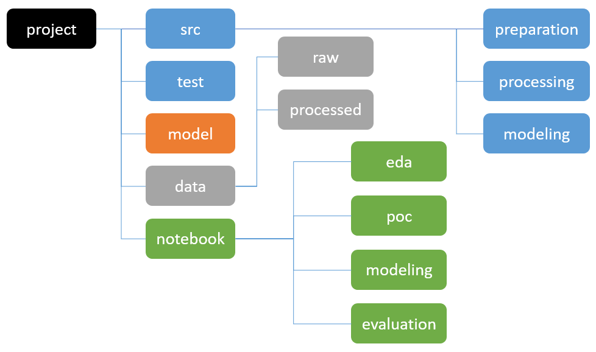

# 50_038_cds_project
Scribe - Tag recognition for transcripts 

# 1. Checkoff 1 (Week 8)

Objectives
- Describe the type of dataset selected or collected
- Problem that we aim to address
- Data visualisation 
- Preliminary naive model

# 2. Final Presentation (Week 13)

- Brief description on problem and dataset
- Elaborate on algorithms used 
- Evaluation Metrics
- Results obtained 
- Implications

# 3. Final report and required sections


# Miscallaneous

### Useful Links
1. https://www.searchtechnologies.com/blog/natural-language-processing-techniques
2. https://www.searchtechnologies.com/nlp-project-feasibility-flowchart
3. https://towardsdatascience.com/machine-learning-text-processing-1d5a2d638958
4. https://medium.com/mlrecipies/document-classification-using-machine-learning-f1dfb1171935
5. https://www.todaysoftmag.com/article/2657/automatic-classification-of-documents-using-natural-language-processing
6. https://www.kdnuggets.com/2015/01/text-analysis-101-document-classification.html
7. https://towardsdatascience.com/machine-learning-nlp-text-classification-using-scikit-learn-python-and-nltk-c52b92a7c73a

### Directory structure
https://towardsdatascience.com/manage-your-data-science-project-structure-in-early-stage-95f91d4d0600

Sample structure from above link


### Environment management

First time use:
```
conda env create -f environment.yml
```

Updating existing environment
```
conda env update -f environment.yml
```

Then
```
conda activate cds
```

Add any additional packages needed by editing environment.yml

### Docker usage
~ still working on it ~

But can try:

```
docker build -t transcriber .
```

```
docker run --rm -p 8888:8888 -e JUPYTER_ENABLE_LAB=yes -v $(pwd):/home/jovyan/work transcriber
```